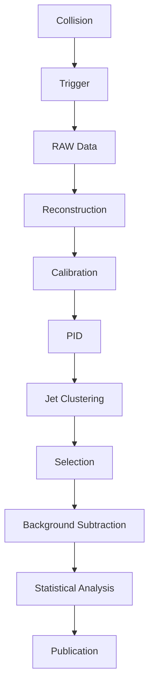

# II.8 Comment les physiciens "lisent" les collisions

## 🎯 Introduction

**Lire une collision** de particules revient à déchiffrer un message codé dans des milliers de détecteurs. Chaque collision produit des données complexes que les physiciens doivent interpréter pour reconstruire ce qui s'est réellement passé.

## 📊 Le pipeline d'analyse des données

### 1. Acquisition brute

#### Le déclencheur (Trigger)
- **Niveau 1 :** Décision en 2.5 μs
- **Niveau 2 :** Analyse plus fine en 40 ms
- **Taux :** 40 millions de collisions/seconde → 100 Hz enregistrés

**🧮 Efficacité du trigger :**
```
ε = Nombre d'événements utiles / Nombre total déclenchés
```

#### Stockage des données
- **Volume :** ~1 PB/an au LHC
- **Format :** RAW data non compressés
- **Transfert :** Réseau dédié à 100 Gbps

### 2. Reconstruction des événements

#### Calibration des détecteurs
- **Électronique :** Correction des gains
- **Géométrie :** Alignement précis (μm)
- **Température :** Compensation des variations

#### Reconstruction des traces
- **Algorithmes :** Kalman filter, Hough transform
- **Précision :** σ = 10-50 μm selon détecteur

## 🔍 Analyse physique

### Identification des particules

#### Sélecteurs de particules (PID)

| Particule | Méthode | Efficacité |
|-----------|---------|------------|
| **Électron** | dE/dx + calorimètre | >95% |
| **Muon** | Chambre à muons | >98% |
| **Photon** | Cristal + isolation | >90% |
| **Hadron** | dE/dx + temps de vol | 80-90% |

#### Variables discriminantes

**🧮 Probabilité d'identification :**
```
P_PID = ∏ᵢ εᵢ / (1 - ∏ᵢ εᵢ)
```

Où εᵢ sont les efficacités individuelles.

### Reconstruction des jets

#### Algorithmes de clustering
- **Cone algorithm :** Géométrique simple
- **kT algorithm :** Basé sur distance transverse
- **Anti-kT :** Préféré pour analyses LHC

#### Étalonnage énergétique
- **Correction :** Absorptions, pertes
- **Précision :** ΔE/E ≈ 2-5% pour |η| < 2.5

## 🎯 Recherche de nouvelles particules

### Analyse par canaux

#### Coupes transverses différentielles

**🧮 Définition :**
```
dσ/dx = (1/σ) × (dN/dx) / (Δx × ε × L)
```

Où :
- **σ** : section efficace totale
- **dN/dx** : nombre d'événements
- **ε** : efficacité
- **L** : luminosité intégrée

#### Recherche d'excès

| Méthode | Application | Sensibilité |
|---------|-------------|-------------|
| **Count + control** | Higgs, SUSY | 5σ discovery |
| **Shape analysis** | Nouvelles résonances | Haute précision |
| **Machine learning** | Signaux complexes | Adaptative |

### Estimation des backgrounds

#### Méthodes de soustraction
- **Data-driven :** Utilisation de données contrôle
- **MC simulation :** Monte Carlo détaillé
- **Hybrid :** Combinaison des deux

**⚠️ Attention :** Un background mal estimé peut cacher une découverte ou créer un faux signal !

## 🤖 Intelligence artificielle en analyse

### Machine Learning appliqué

#### Classification d'événements
- **BDT (Boosted Decision Trees) :** Classique et efficace
- **Neural Networks :** Pour patterns complexes
- **Deep Learning :** Images de détecteurs

#### Exemple : Classification top/antitop

| Méthode | Accuracy | Temps CPU |
|---------|----------|-----------|
| **Coupes manuelles** | 85% | Faible |
| **BDT** | 92% | Moyen |
| **Neural Network** | 95% | Élevé |

### Reconstruction automatique
- **Vertex finding :** Identification des points d'origine
- **Track fitting :** Ajustement de trajectoires
- **Energy flow :** Reconstruction énergétique

## 📈 Statistiques et incertitudes

### Méthodes statistiques

#### Test de significativité

**🧮 Significativité :**
```
Z = (S - B) / √(S + B)
```

Où :
- **S** : signal attendu
- **B** : background estimé
- **Z** : nombre d'écarts-types

**✓ Bonnes pratiques :** Z > 5σ pour une découverte, Z > 3σ pour une indication.

### Gestion des erreurs systématiques

#### Sources principales
- **Théorique :** Incertitudes sur prédictions QCD
- **Expérimentale :** Calibrations, efficacités
- **Modélisation :** Simulation imparfaite

#### Méthode des covariances
- **Matrice :** Correlations entre paramètres
- **Propagation :** Impact sur résultats finaux

## 🎨 Visualisation et interprétation

### Outils de visualisation

#### Event displays
- **ATLAS :** Atlantis, VP1
- **CMS :** Iguana, Fireworks
- **ALICE :** Eve, AliEve

#### Exemple : Événement Higgs → ZZ → 4μ
```
Électrons/Muons isolés
Masse invariante ≈ 125 GeV
Trajectoires compatibles
```

### Communication des résultats

#### Publications
- **Format :** Paper LHC avec 3000+ auteurs
- **Revue :** Soumission à arXiv + journaux

#### Présentations
- **Conférences :** ICHEP, EPS, Moriond
- **Transparence :** Données publiques

## 🌍 Impact sociétal

### Transparence scientifique

**💡 Conseil :** Les analyses LHC sont ouvertes : données publiques, code partagé, méthodes documentées.

### Formation et pédagogie

- **Open Data :** Jeux de données pour étudiants
- **Outils éducatifs :** Visualisations simplifiées
- **MOOCs :** Cours en ligne sur analyses

## 📚 Synthèse et évaluation

### ✅ Points clés à retenir

- **Pipeline complexe** : De la collision aux résultats
- **Statistiques cruciales** : Significativité et incertitudes
- **IA omniprésente** : Classification et reconstruction
- **Transparence totale** : Science ouverte

### 📊 Workflow typique d'analyse LHC



### 🎯 Évaluation personnelle

**Questions de synthèse :**
1. Pourquoi faut-il déclencher sur seulement 100 Hz sur 40 MHz ?
2. Comment différencier un vrai signal d'un background ?
3. Quel rôle joue l'IA dans l'analyse moderne ?

### 🔗 Références croisées

- **[II.7 L'analyse des données](analyse-donnees.md)** : Complète cette section
- **[II.9 IA et statistiques](ia-statistiques.md)** : Technologies avancées
- **[III.6 Découverte 2012](https://github.com/michaelgermini/La-Physique-des-Particules-pour-Tous/blob/master/Partie%20III%20-%20Modele%20Standard/decouverte-2012.md)** : Cas d'application

---

*L'analyse des collisions est un mélange fascinant de physique, statistiques, informatique et intuition humaine.* 🔬📊🤖
